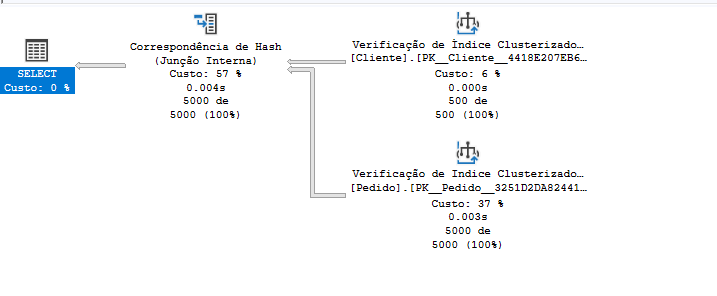

# Otimizando as Consultas

O principal meio para otimizar as consultas foi a criação de index nas FKs. 

Em consultas que necessitava de uma otimização melhor o uso de index não clusterizado foi utilizado 

## Consulta 1

## Consulta 2

Plano de Execução  - 

Consulta sem index - 0,102458

Consulta com index - 0,05989

